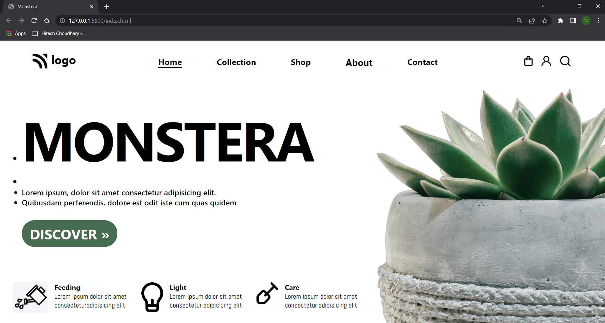

# 6.Plant Home Page

## Learnings:

- How to handle the overflow
- How to add different list type.
- Flexbox
- How to positon images with view port height.

## Time Taken:

- 5 Hours

## Preview Of Site:

## Live Link

[link](https://monsterahomepage.netlify.app/)
